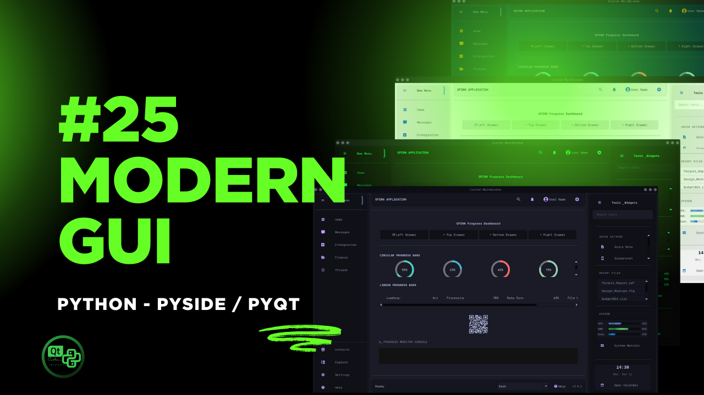

[](https://github.com/SpinnCompany/QT-PyQt-PySide-Custom-Widgets/blob/master/LICENSE)
[](https://github.com/SpinnCompany/QT-PyQt-PySide-Custom-Widgets)
[](https://github.com/SpinnCompany/QT-PyQt-PySide-Custom-Widgets/issues)

# 25 Modern GUI Tutorial

This repository accompanies the **25 Modern GUI Tutorial**, providing a complete project structure for PySide6 / PyQt / Qt-based applications.

**Watch the full video tutorial:** [https://youtu.be/K4hin5wMlec](https://youtu.be/K4hin5wMlec)

**Documentation:**

* [Official Docs](https://qtcustomwidgets.spinncode.com/)
* [GitHub Pages Docs](https://spinncompany.github.io/Docs-QT-PyQt-PySide-Custom-Widgets/)

It includes custom widgets, automatic UI-to-Python conversion, style management, and a clean, scalable architecture suitable for modern desktop applications.

---

## Project Structure

```
.
├── README.md                
├── requirements.txt         
├── main.py                  
│
├── ui/                      
│   ├── main_window.ui       
│   └── ...other UI files
│
├── src/                     
│   ├── __init__.py
│   ├── utils.py             
│   ├── helper_functions.py  
│   ├── ui_main_window.py    
│   └── ...more modules
│
├── qss/                     
│   ├── scss/                
│   └── icons/               
│
├── logs/
│   └── custom_widgets.log   
│
├── json_styles/             
│   └── style.json
│
└── generated-files/         
    ├── Converted UI Python files
    └── Generated JSON configurations
```

---

## Overview

This structure is designed to support modern GUI development by:

* Automatically converting `.ui` files into Python modules
* Keeping UI files, generated files, and source code organized
* Managing styles using SCSS, QSS, and JSON layers
* Providing a clean architecture for large-scale GUI applications

The goal is to simplify GUI development for both beginners and advanced developers, making the tutorial easy to follow and extend.

---

## Support and Full Source Code

Full project source code, extended materials, and additional lessons are available to supporters.

To access the complete source code and support future tutorials:

* **Patreon:** [https://www.patreon.com/c/spinntv](https://www.patreon.com/c/spinntv)
* Tutorial link for reference: [https://youtu.be/K4hin5wMlec](https://youtu.be/K4hin5wMlec)

Your support directly helps maintain and expand this project and future GUI tutorials.

---

## Repository

For updates and the main custom widgets module:

[https://github.com/SpinnCompanyu/QT-PyQt-PySide-Custom-Widgets](https://github.com/SpinnCompanyu/QT-PyQt-PySide-Custom-Widgets)

